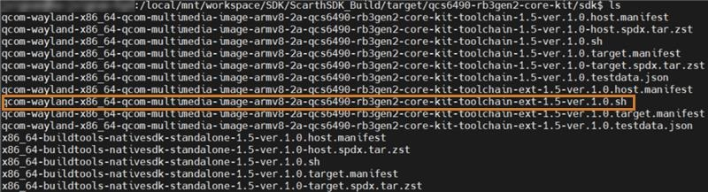

.. _howto_build:

Build
-----------

.. _section_gcp_5hh_q1c_vinayjk_03-04-24-2335-11-750:

How do I know if my build is completed?
^^^^^^^^^^^^^^^^^^^^^^^^^^^^^^^^^^^^^^^^^^

If your build instruction is ``bitbake qcom-multimedia-image``, then you
can check if ``system.img`` is present in the
``<workspace_path>/build-qcom-wayland/tmp-glibc/deploy/images/qcs6490-rb3gen2-vision-kit/qcom-multimedia-image``
directory:

::

   cd <workspace_path>/build-qcom-wayland/tmp-glibc/deploy/images/qcs6490-rb3gen2-vision-kit/qcom-multimedia-image
   ls -al system.img

.. _section_bcj_vhh_q1c_vinayjk_03-04-24-2335-25-265:

How to generate eSDK?
^^^^^^^^^^^^^^^^^^^^^^^^^^^^

**Get a Docker shell and shell prompt**

1. List the Docker images:

   ::

      docker images

   The output for this command is as follows:

   ::

      REPOSITORY                                                           TAG                         IMAGE ID       CREATED        SIZE
      032693710300.dkr.ecr.us-west-2.amazonaws.com/stormchaser/ql-tool     20.04.20231220102843864.9   864b345bd707   2 months ago   715MB
      032693710300.dkr.ecr.us-west-2.amazonaws.com/stormchaser/le.um-k2c   20.04.20231215014450998.7   4678dda58a91   2 months ago   929MB

2. Attach the container:

   ::

      WORKSPACE=<WORKSPACE_PATH> && SRC_DIR=<SoftwareImage> && docker run --rm  -it -v ~/.qualcomm_launcher_workspace_config:/var/tmp/.docker_qualcomm_launcher_setup/ -v $WORKSPACE:$WORKSPACE -e LOCAL_USER_NAME=`id -u -n` -e LOCAL_USER_ID=`id -u` -e USER=`id -u` -e WORKSPACE=$WORKSPACE -w $WORKSPACE/$SRC_DIR <REPOSITORY:TAG> bash

      # Example
      WORKSPACE=/local/mnt/workspace/Qworkspace/DEV && SRC_DIR=LE.QCLINUX.1.0.r1 && docker run --rm  -it -v ~/.qualcomm_launcher_workspace_config:/var/tmp/.docker_qualcomm_launcher_setup/ -v $WORKSPACE:$WORKSPACE -e LOCAL_USER_NAME=`id -u -n` -e LOCAL_USER_ID=`id -u` -e USER=`id -u` -e WORKSPACE=$WORKSPACE -w $WORKSPACE/$SRC_DIR 032693710300.dkr.ecr.us-west-2.amazonaws.com/stormchaser/le.um-k2c:20.04.20231215014450998.7 bash

Check if you are in a workspace that has ``.repo`` in it. Set up the
environment and generate eSDK:

.. note:: When the eSDK generation build command is complete, the images
          are generated in the following directory: ``<workspace_path>/build-qcom-wayland/tmp-glibc/deploy/sdk``.

1. After building ``meta-qcom-hwe`` with QSC CLI:

   ::

      MACHINE=<machine> DISTRO=qcom-wayland QCOM_SELECTED_BSP=custom source setup-environment
      # Example, MACHINE=qcs6490-rb3gen2-vision-kit DISTRO=qcom-wayland QCOM_SELECTED_BSP=custom source setup-environment
      bitbake -c do_populate_sdk_ext <image>
      # Example, bitbake -c do_populate_sdk_ext qcom-multimedia-image

   .. note::
      To know the ``<machine>`` parameter values, see `Release Notes <https://docs.qualcomm.com/bundle/publicresource/topics/RNO-240929204440/>`__.    

2. After building with ``meta-qcom-extras`` and firmware sources with
   QSC CLI:

   .. note:: This step is not applicable for public developers (unregistered).

   ::

      # Example
      export EXTRALAYERS="meta-qcom-extras"
      export CUST_ID="213195"
      export FWZIP_PATH="/local/mnt/workspace/extras/DEV/QCM6490.LE.1.0/common/build/ufs/bin"
      MACHINE=<machine> DISTRO=qcom-wayland QCOM_SELECTED_BSP=custom source setup-environment
      # Example, MACHINE=qcs6490-rb3gen2-vision-kit DISTRO=qcom-wayland QCOM_SELECTED_BSP=custom source setup-environment
      bitbake -c do_populate_sdk_ext qcom-multimedia-image

3. After building Standalone instructions within the same shell (shell
   where build is successful):

   ::

      bitbake -c do_populate_sdk_ext <image>

      # Example
      bitbake -c do_populate_sdk_ext qcom-multimedia-image

4. After building with standalone instructions and with new shell
   (assuming build workspace exists):

   ::

      cd <workspace_path>
      MACHINE=<machine> DISTRO=qcom-wayland QCOM_SELECTED_BSP=custom source setup-environment
      bitbake -c do_populate_sdk_ext <image>

      # Example
      cd /local/mnt/workspace/LE.QCLINUX.1.0.r1
      MACHINE=qcs6490-rb3gen2-vision-kit DISTRO=qcom-wayland QCOM_SELECTED_BSP=custom source setup-environment
      bitbake -c do_populate_sdk_ext qcom-multimedia-image

5. After building with standalone instructions using Dockerfile.

   a. Move the control to workspace directory:

      ::

         cd /local/mnt/workspace/qcom-download-utils/<release>

         # Example
         cd /local/mnt/workspace/qcom-download-utils/qcom-6.6.38-QLI.1.2-Ver.1.0

   #. Set up the environment and issue an eSDK build:

      ::

         MACHINE=<machine> DISTRO=qcom-wayland QCOM_SELECTED_BSP=custom source setup-environment
         bitbake -c do_populate_sdk_ext <image>

         # Example
         MACHINE=qcs6490-rb3gen2-vision-kit DISTRO=qcom-wayland QCOM_SELECTED_BSP=custom source setup-environment
         bitbake -c do_populate_sdk_ext qcom-multimedia-image

**eSDK generation troubleshooting – basehash mismatch**

**Error excerpt**

::

   ERROR: When reparsing /local/mnt/workspace/extras/DEV/LE.QCLINUX.1.0.r1/build-qcom-wayland/conf/../../layers/meta-qcom-distro/recipes-products/images/qcom-multimedia-image.bb:do_populate_sdk_ext, the basehash value changed from 7bce27b0510cb666f1bba1d03f055cfef48f9db2eabc17d490e14bbe4c632eba to 48ccd9d7370e0bf2435aa8b5067162932e07a3832adfa6ca037aa0ddb765c8de. The metadata is not deterministic and this needs to be fixed.
   ERROR: The following commands may help:
   ERROR: $ bitbake qcom-multimedia-image -cdo_populate_sdk_ext -Snone
   ERROR: Then:
   ERROR: $ bitbake qcom-multimedia-image -cdo_populate_sdk_ext -Sprintdiff

**Solution**

Rebuild the image and generate eSDK again.

.. _section_hjt_vhh_q1c_vinayjk_03-04-24-2335-32-213:

How to rebuild using Docker environment?
^^^^^^^^^^^^^^^^^^^^^^^^^^^^^^^^^^^^^^^^^^

Following are the commands to connect to Docker for your environment
setup and then use the BitBake commands to rebuild:

::

   cd <workspace_path>/DEV/<softwareimage>
   # Example, cd /local/mnt/workspace/Qworkspace/DEV/LE.QCLINUX.1.0.r1 for making changes to Yocto layers
   # Make code changes

.. note:: 
   Get to a Docker shell as mentioned in :ref:`How to generate eSDK? <section_bcj_vhh_q1c_vinayjk_03-04-24-2335-25-265>`.

-  Rebuild using your source changes:

   ::

      # Rebuild commands
      MACHINE=<machine> DISTRO=qcom-wayland QCOM_SELECTED_BSP=custom source setup-environment
      # Example, MACHINE=qcs6490-rb3gen2-vision-kit DISTRO=qcom-wayland QCOM_SELECTED_BSP=custom source setup-environment
      bitbake qcom-multimedia-image

   .. note::
      To know the ``<machine>`` parameter values, see `Release Notes <https://docs.qualcomm.com/bundle/publicresource/topics/RNO-240929204440/>`__.

-  Build image ``qcom-multimedia-test-image``:

   ::

      MACHINE=<machine> DISTRO=qcom-wayland QCOM_SELECTED_BSP=custom source setup-environment
      # Example, MACHINE=qcs6490-rb3gen2-vision-kit DISTRO=qcom-wayland QCOM_SELECTED_BSP=custom source setup-environment
      bitbake qcom-multimedia-test-image

.. _how_to_build_qdl_standalone:

How to build a standalone QDL?
^^^^^^^^^^^^^^^^^^^^^^^^^^^^^^^^^^^

**Prerequisites:**

-  The modules ``make`` and ``gcc`` must be available.

-  Install the following dependent packages:

   ::

      sudo apt-get install git libxml2-dev libusb-1.0-0-dev pkg-config

1. Download and compile the Linux flashing tool (QDL):

   ::

      git clone --depth 1 --branch master https://github.com/linux-msm/qdl
      cd qdl
      git checkout cbd46184d33af597664e08aff2b9181ae2f87aa6
      make

2. Flash using the generated QDL:

   ::

      ./qdl --storage ufs --include <workspace_path>/build-qcom-wayland/tmp-glibc/deploy/images/qcs6490-rb3gen2-vision-kit/qcom-multimedia-image <workspace_path>/build-qcom-wayland/tmp-glibc/deploy/images/qcs6490-rb3gen2-vision-kit/qcom-multimedia-image/prog_firehose_ddr.elf <workspace_path>/build-qcom-wayland/tmp-glibc/deploy/images/qcs6490-rb3gen2-vision-kit/qcom-multimedia-image/rawprogram*.xml <workspace_path>/build-qcom-wayland/tmp-glibc/deploy/images/qcs6490-rb3gen2-vision-kit/qcom-multimedia-image/patch*.xml

.. _section_nqg_cj3_v1c_vinayjk_03-23-24-006-3-877:

How can I change the Hexagon tool install path?
^^^^^^^^^^^^^^^^^^^^^^^^^^^^^^^^^^^^^^^^^^^^^^^^^^^^^^^^

``HEXAGON_ROOT`` environment variable must point to the path where the Hexagon tools are installed. By default, ``qpm-cli`` installs ``HEXAGON_ROOT`` in ``$HOME``. You can also choose an alternate directory to install ``HEXAGON_ROOT``.

You can use the ``––path`` option in ``qpm-cli`` command to install Hexagon tools in a directory of your choice and export the ``HEXAGON_ROOT`` variable to the same directory.

Provide an absolute path for ``<TOOLS_DIR>`` in ``qpm-cli`` and export commands as shown in the following example:

::

   # Example
    
   mkdir -p <TOOLS_DIR>
   qpm-cli --extract hexagon8.4 --version 8.4.07 --path <TOOLS_DIR>/8.4.07
   export HEXAGON_ROOT=<TOOLS_DIR>

.. _section_x3c_n5l_zbc_vinayjk_07-08-24-1744-58-455:

What are the image recipes supported in the GitHub workflow?
^^^^^^^^^^^^^^^^^^^^^^^^^^^^^^^^^^^^^^^^^^^^^^^^^^^^^^^^^^^^^^^^^^^^^^

+------------------------------------+------------------------------------------+
| Image recipe                       | Description                              |
+====================================+==========================================+
| ``qcom-minimal-image``             | A minimal rootfs image that              |
|                                    | boots to shell                           |
+------------------------------------+------------------------------------------+
| ``qcom-console-image``             | Boot to shell with package               |
|                                    | group to bring in all the basic          |
|                                    | packages                                 |
+------------------------------------+------------------------------------------+
| ``qcom-multimedia-image``          | Image recipe includes recipes            |
|                                    | for multimedia software                  |
|                                    | components, such as, audio,              |
|                                    | Bluetooth\ :sup:`®`, camera, computer    |
|                                    | vision, display, and video.              |
+------------------------------------+------------------------------------------+
| ``qcom-multimedia-test-image``     | Image recipe that includes               |
|                                    | tests                                    |
+------------------------------------+------------------------------------------+

.. _section_imr_xc4_1cc_vinayjk_07-12-24-1513-38-780:

How to download the Platform eSDK?
^^^^^^^^^^^^^^^^^^^^^^^^^^^^^^^^^^^

1. Check the :ref:`host machine requirements <host_machine_req_github_workflow_unregistered_users>`.

2. Set up the :ref:`Ubuntu host <section_twd_1bv_xbc_vinayjk_07-02-24-2039-30-667>`.

3. Download the Platform eSDK:

   a. Create a directory:

      ::

         mkdir <workspace_path>

   #. Open the directory:

      ::

         cd <workspace_path>

   #. Download the zipped file:

      -  For Ubuntu x86 architecture-based host machines:

         ::

            wget https://artifacts.codelinaro.org/artifactory/qli-ci/flashable-binaries/qimpsdk/qcs6490-rb3gen2-core-kit/x86/qcom-6.6.38-QLI.1.2-Ver.1.0_qim-product-sdk-1.1.1.zip

      -  For Arm architecture-based host machines:

         ::

            wget https://artifacts.codelinaro.org/artifactory/qli-ci/flashable-binaries/qimpsdk/qcs6490-rb3gen2-core-kit/arm/qcom-6.6.38-QLI.1.2-Ver.1.0_qim-product-sdk-1.1.1.zip

   #. Unzip the QIMP SDK to a directory of your choice:

      ::

         unzip qcom-6.6.38-QLI.1.2-Ver.1.0_qim-product-sdk-1.1.1.zip

      After unzipping, ensure that the eSDK installer is located at
      ``<unzip_location>/target/qcm6490/sdk/``:
      
      |imageunzipESDK|

   #. If you do not have the necessary write permissions for the
      directory where you are trying to install the eSDK, the installer
      alerts you and then terminates. In such a scenario, set up the
      permissions in the directory appropriately by using the following
      command and rerun the installer:

      ::

         umask a+rx

4. Run the installer script to install the eSDK. For example:

   ::

      sh ./qcom-wayland-x86_64-qcom-multimedia-image-armv8-2a-qcm6490-toolchain-ext-1.0.sh

5. Follow the instructions on the console to install the eSDK in a convenient location of your host machine.

6. Ensure that the eSDK installation is successful.

   After installation, the QIMP SDK layers are included under ``<workspace_path>/layers``:

   |imageLayerWorkspace|

   .. note:: Advanced developers can still build their own eSDK by following the steps mentioned in `Advanced procedure <https://docs.qualcomm.com/bundle/publicresource/topics/80-70015-51/advanced-procedure.html>`__.

7. Run the following command to set the ``ESDK_ROOT`` variable:

   ::

      export ESDK_ROOT=<pathofinstallationdirectory>

   For example:

   ::

      export ESDK_ROOT=/local/mnt/workspace/Platform_eSDK_plus_QIM

The QIMP SDK installation is now complete. To develop an application for
the device, see `Develop your first application <https://docs.qualcomm.com/bundle/publicresource/topics/80-70015-51/content-develop-your-first-application.html>`__.

.. |imageLayerWorkspace| image:: ../../media/k2c-qli-build-ga/qimp_sdk_layers.png
