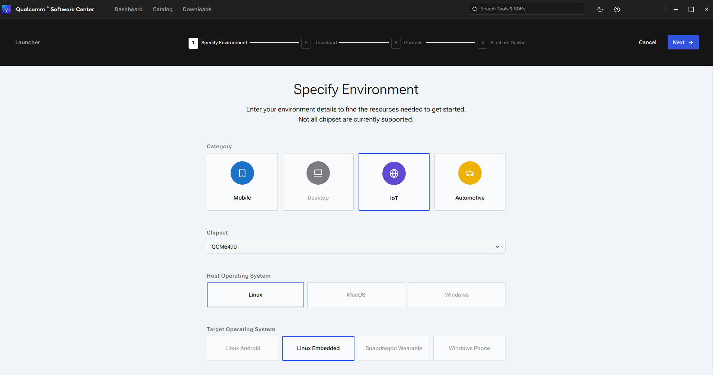

.. _concept_n2t_tjn_w1c:

Use QSC Launcher
-------------------------

.. note::
  
    A one-time login is required into `chipcode.qti.qualcomm.com <http://chipcode.qti.qualcomm.com/>`__ to download Qualcomm proprietary git repositories. Use your Qualcomm login credentials to complete this step.

1. To open the QSC Launcher desktop application, either launch **Qualcomm Software Center** from the **Applications** menu or run the following command from the Linux terminal:

   ::

      /opt/qcom/softwarecenter/bin/softwarecenter

   .. note:: 
       For the Launcher workflow to detect the connected devices and flash the software builds, ensure that the Qualcomm Product Configuration Assistant Tool (PCAT) and Qualcomm USB Driver (QUD) are installed on the host machine. Click **PCAT** to install PCAT and **QUD** to install QUD as shown in the following image:

      .. image:: ../../media/k2c-qli-build-ga/QSC_has_PCAT_QUD_install_info.png

      **Or**

      Install PCAT and QUD using ``qpm-cli``:

      ::

         qpm-cli --login
         qpm-cli --install pcat --activate-default-license
         qpm-cli --install qud --activate-default-license

      The ``qpm-cli --help`` command lists the help options.

      For Ubuntu 22.04, you may encounter an issue while installing QUD where you are asked to enroll the public key on your Linux host for a successful QUD installation. For more information, follow the steps provided in the ``signReadme.txt`` file available at the ``/opt/QUIC/sign/`` directory.

2. Use your Qualcomm ID to log in to the QSC desktop application. A dashboard page appears as shown in the following figure:

   .. image:: ../../media/k2c-qli-build-ga/start_launcher_ab.png

   -  If you do not have a connected device, click **Start Launcher** (A) on the top panel to start the steps to configure, download, compile, and flash Qualcomm Linux to your device.
   -  If you have a connected device, click **Start Launcher** (B) for the appropriate device in the **Connected devices** panel to download, compile, and flash Qualcomm Linux to your connected device.

3. On the **Specify Environment** page, select the following values based on the build:

   -  Category: **IoT**
   -  Chipset: **QCM6490**
   -  Host OS: **Linux**
   -  Target OS: **LE** 

   .. note:: For more information on the supported chip products, see `Release Notes <https://docs.qualcomm.com/bundle/publicresource/topics/RNO-240911224732/>`__.

4. Click **Next**.
   
   The **Select Resources** page appears.

5. On the **Select Resources** page, perform the following steps:

   .. image:: ../../media/k2c-qli-build-ga/prebuilt_software_options.png

   a. In the **Base Workspace Path** text box, specify a directory where you want to download the software. To display the directory selection window, click the select icon.

   b. Select the **Software Product** (For chipset QCM6490 and target OS LE,
      **QCM6490.LE.1.0** is the software product).

   c. Select the **Distribution**.

   d. Select the **Release Tag**. (See the latest `Release Notes <https://docs.qualcomm.com/bundle/publicresource/topics/RNO-240911224732/>`__. For example, **r00218.1**).

  ..
      .. flat-table:: Access controlled distributions
         :widths: 24 24 24
         :header-rows: 1
         :class: longtable table-wrap
      
         * - **Access level**
           - **Distribution**
           - Yocto layers
         * - :rspan:`2` Public developers (unregistered)
           - Board support package (BSP) build: High-level operating system (OS) and prebuilt firmware (GPS only)       
             
             ``Qualcomm_Linux.SPF.1.0|TEST|DEVICE|PUBLIC``
           - ``meta-qcom``       
             
             ``meta-qcom-hwe``

             ``meta-qcom-distro``
         *  
           - BSP build + Qualcomm Intelligent Multimedia Product (QIMP) SDK
             
             ``Qualcomm_Linux.SPF.1.0|TEST|DEVICE|PB_QIMPSDK``
           - ``meta-qcom``      
             
             ``meta-qcom-hwe``

             ``meta-qcom-distro``
             
             ``meta-qcom-qim-product-sdk``
         *  
           - BSP build + QIMP SDK + Qualcomm Intelligent Robotics Product (QIRP) SDK
             
             ``Qualcomm_Linux.SPF.1.0|TEST|DEVICE|RoboApiLnx``
           - ``meta-qcom``   
             
             ``meta-qcom-hwe``

             ``meta-qcom-distro``
             
             ``meta-ros``
             
             ``meta-qcom-robotics``
             
             ``meta-qcom-robotics-distro``
             
             ``meta-qcom-robotics-sdk``
             
             ``meta-qcom-qim-product-sdk``
         * - :rspan:`2` Licensed developers with authorized access
           - BSP build: High-level OS and firmware source (GPS only)
             
             ``Qualcomm_Linux.SPF.1.0|AP|Standard|OEM|NoModem``
           - ``meta-qcom``    
             
             ``meta-qcom-hwe``

             ``meta-qcom-distro``
             
             ``meta-qcom-extras``
         *  
           - BSP build + QIMP SDK
             
             ``Qualcomm_Linux.SPF.1.0|AP|Standard|OEM|NM_QIMPSDK``
           - ``meta-qcom``  
             
             ``meta-qcom-hwe``

             ``meta-qcom-distro``
             
             ``meta-qcom-extras``
             
             ``meta-qcom-qim-product-sdk``
             
             ``meta-qcom-robotics-distro``
             
             ``meta-qcom-robotics-sdk``
             
             ``meta-qcom-qim-product-sdk``
         *  
           - BSP build + QIMP SDK + QIRP SDK
             
             ``Qualcomm_Linux.SPF.1.0|AP|Standard|OEM|NM_QIRPSDK``
           - ``meta-qcom``
             
             ``meta-qcom-hwe``

             ``meta-qcom-distro``
             
             ``meta-qcom-extras``
             
             ``meta-qcom-robotics-extras``
             
             ``meta-ros``
             
             ``meta-qcom-robotics``
             
             ``meta-qcom-robotics-distro``
             
             ``meta-qcom-robotics-sdk``
             
             ``meta-qcom-qim-product-sdk``
         * - :rspan:`3` Licensed developers (contact Qualcomm for access)
           - BSP build: High-level OS and firmware (GPS only) source
             
             ``Qualcomm_Linux.SPF.1.0|AP|Standard|OEM|``
           - ``meta-qcom``
             
             ``meta-qcom-hwe``

             ``meta-qcom-distro``
             
             ``meta-qcom-extras``
         *  
           - BSP build + QIMP SDK (GPS only)
             
             ``Qualcomm_Linux.SPF.1.0|AP|Standard|OEM|QIMPSDK``
           - ``meta-qcom``
             
             ``meta-qcom-hwe``

             ``meta-qcom-distro``
             
             ``meta-qcom-extras``
             
             ``meta-qcom-qim-product-sdk``
         *  
           - BSP build: High-level OS and firmware (GPS and modem) source
             
             ``Qualcomm_Linux.SPF.1.0|AMSS|Standard|OEM|``
           - ``meta-qcom``
             
             ``meta-qcom-hwe``

             ``meta-qcom-distro``
             
             ``meta-qcom-extras``
         *  
           - BSP build + QIMP SDK (GPS and modem)
             
             ``Qualcomm_Linux.SPF.1.0|AMSS|Standard|OEM|QIMPSDK``
           - ``meta-qcom``
             
             ``meta-qcom-hwe``

             ``meta-qcom-distro``
             
             ``meta-qcom-extras``
             
             ``meta-qcom-qim-product-sdk``
	  
      .. note::
         
         - For more information on the available distributions, see the **Access Controlled Distribution** table in the `Release Notes <https://docs.qualcomm.com/bundle/publicresource/topics/RNO-240911224732/>`__.
         - For more information on the Yocto layers, see `Qualcomm Linux metadata layers and descriptions <https://docs.qualcomm.com/bundle/publicresource/topics/80-70015-27/platform_software_features.html#id7>`__.         
         - For more information on the QIMP and QIRP SDKs, see the following guides:

           - `QIMP SDK Quick Start Guide <https://docs.qualcomm.com/bundle/publicresource/topics/80-70015-51>`__
           - `QIRP SDK 2.0 User Guide <https://docs.qualcomm.com/bundle/publicresource/topics/80-70015-265>`__

6.  Click **Download** to download the selected compilable distribution or prebuilt binary.

    The **Download** page displays the download progress as shown in the following figure:

    .. image:: ../../media/k2c-qli-build-ga/prebuilt_download.png

    Prebuilt binaries do not require compilation. If a prebuilt binary is selected, follow the onscreen prompts to flash to a connected device:

    .. image:: ../../media/k2c-qli-build-ga/prebuilt_compile.png

.. _concept_n2t_tjn_w1c_step7:

7.  After the download completes, select **Compile** to start compiling (depending on the size of the downloaded software and host machine configuration, compilation may take a few hours):

    .. image:: ../../media/k2c-qli-build-ga/download.png

8.  To view the compilation progress of individual software images, expand the logs panel as shown in the following figure:

    .. image:: ../../media/k2c-qli-build-ga/QSC_compile_progress.png

    After a successful build of the ``qcom-wayland`` distributions, you can see the software images at the following path:

    ::

       # system.img is present at the following path
       <Base_Workspace_Path>/DEV/LE.QCLINUX.1.0.r1/build-qcom-wayland/tmp-glibc/deploy/images/qcs6490-rb3gen2-vision-kit/qcom-multimedia-image/*

    After a successful build of the ``qcom-robotics-ros2-humble`` (QIRP) distribution, you can see the QIRP SDK build artifacts at the following paths:

    ::

       QIRP SDK artifacts: <Base_Workspace_Path>/DEV/LE.QCROBOTICS.1.0.r1/build-qcom-robotics-ros2-humble/tmp-glibc/deploy/qirpsdk_artifacts/qirp-sdk_<version>.tar.gz
       # system.img is present at the following path
       Robotics image: <Base_Workspace_Path>/DEV/LE.QCROBOTICS.1.0.r1/build-qcom-robotics-ros2-humble/tmp-glibc/deploy/images/qcs6490-rb3gen2-vision-kit/qcom-robotics-full-image/*

    .. note::
      
       * ``<Base_Workspace_Path>`` is the path that you select on the **Select Resources** page.
       * BitBake fetch errors are typically intermittent fetch failures.
         Retry :ref:`step 7 <concept_n2t_tjn_w1c_step7>` to get past these intermittent errors. If the issue persists, see :ref:`BitBake Fetcher Error <do_fetch_error_1>` for a solution.

9.  To flash the software, select the device on which you want to flash the compiled software from the list of connected devices. Select the correct target device when multiple devices are connected to the host machine:

    .. image:: ../../media/k2c-qli-build-ga/flash.png

10. To execute the build commands for a specific software image, click **Compile using terminal** next to that software image:

    .. note:: Compilations executed through the terminal are not tracked by the Qualcomm Software Center and the ability to monitor their status on the Download page is lost.

    .. image:: ../../media/k2c-qli-build-ga/compile_terminal.png

    .. image:: ../../media/k2c-qli-build-ga/compile_terminal_default.png

    .. image:: ../../media/k2c-qli-build-ga/compile_terminal_example.png

.. _section_cmp_qbj_x1c:

Flash
^^^^^^^

.. note:: 
   Ensure that the device is in Emergency Download (EDL) mode
   before you flash the software. For more information on how to force the device into EDL mode, see :ref:`Move to EDL mode <section_vgg_mly_v1c>`.

To flash the software to the device with QSC Launcher, perform the following steps:

1. With the device connected and in EDL mode, select the device on which you want to flash the software as shown in the following figure:

   .. image:: ../../media/k2c-qli-build-ga/qsc_select_device_v2.jpg

2. Click **Flash on device**. The page updates and displays a progress bar as Launcher begins flashing the software. Leave the device connected while the software is being flashed.

3. To view logs, expand the logs panel as shown in the following figure:

   .. image:: ../../media/k2c-qli-build-ga/flash_launcher_logs.png

4. When the process is finished, *Flash Complete* and other similar messages are displayed on the page:

   .. image:: ../../media/k2c-qli-build-ga/flash_launcher_flashComplete.png

5. Click **Done**. To connect to the device, 
   see :ref:`How to SSH <section_hmw_vsh_p1c_vinayjk_03-01-24-1110-45-279>`.

